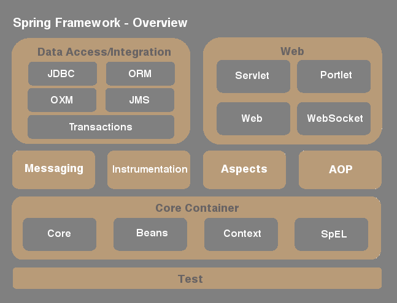

////
  Copyright 2021 The Bank of New York Mellon.

  Licensed under the Apache License, Version 2.0 (the "License");
  you may not use this file except in compliance with the License.
  You may obtain a copy of the License at

    http://www.apache.org/licenses/LICENSE-2.0

  Unless required by applicable law or agreed to in writing, software
  distributed under the License is distributed on an "AS IS" BASIS,
  WITHOUT WARRANTIES OR CONDITIONS OF ANY KIND, either express or implied.
  See the License for the specific language governing permissions and
  limitations under the License.
////
= Spring Framework
:toc:
:toclevels: 4

This is a tutorial on Spring Framework.

== Principles First

Before diving into Spring, a review of a few principles is necessary.

== S-O-L-I-D PRINCIPLES

SOLID is an acronym for five principles of object-oriented design and programming.

.The five principles
[options="header" cols="^10%,<30%,<60%"]
|===
| Letter
| Principle
| Explanation

| S
| **Single responsibility principle**
| Each responsibility should be a separate class, because each responsibility is an axis of change.
| O
| **Open/closed principle**
| There should be no need to change existing code or classes: All new functionality can be added by
adding new subclasses or methods, or by reusing existing code through delegation.”
| L
| **Liskov substitution principle**
| If an instance of the derived class is substituted in a call to a base class method, nothing
should break that always works for the base class, as specified by the base class interface.
| I
| **Interface segregation principle**
| The dependency of one class to another one should depend on the smallest possible interface.
| D
| **Dependency inversion principle**
| Abstractions should not depend upon details. Details should depend upon abstractions.
|===

Spring framework meets all the above principles.

== What is Spring?

Spring is an application framework. The framework itself comprises several modules building on a 
spring-core.

Spring framework provides comprehensive infrastructure support for developing Java applications.

Spring handles the infrastructure, so a developer can focus on the application.

Spring adheres to all five of the SOLID principles.

=== Spring Framework - Overview

The below picture is an overview of the Spring Framework.

Many more extensions exist to enhance the Spring Framework.

=== Spring Framework - Core Components

Spring Core container is the base layer for the framework and consists of:

- *`spring-core`*: +
  consists of core utilities and factories. Most Spring jars depend on spring-core.
  Some basic DI and IoC factories are a part of this module.

- *`spring-beans`*: +
  consists of the DI and IoC code. Most of the code to manage bean properties is
  located in this module.

- *`spring-context`*: +
  builds on the core and beans modules to introduce context awareness and a
  bean registry. Provides support for internationalization, resource bundling, event propagation.
  Along with a *`spring-context-support`*, provides integration capabilities for caching, scheduling,
  mailing and templates.

- *`spring-expression`*: +
  consists of the DI and IoC code. Most of the code to manage bean
  properties is located in this module.

=== Spring Framework - Other Components

Spring framework has several other components, popular among which are :

- *`spring-aop`*, *`spring-aspects`* and *`spring-instrument`*: +
  which provide for method
  interceptors, pointcuts and aspect oriented utilities. Instrumentation provides class
  instrumentation support and classloader implementations. - AOP/Instrumentation

- *`spring-messaging`*: +
  provides a foundation for messaging-based applications and includes
  top-level abstractions used in messaging - Messaging Infrastructure.

- *`spring-jdbc`*, *`spring-tx`*, *`spring-orm`* and *`spring-jms`*: +
  are the database and messaging modules - Data Access/Integration.

- *`spring-web`*, *`spring-webmvc`*, *`spring-websocket`* and *`spring-webmvc-portlet`*: +
  provide most features needed to operate the Spring framework container tied to the web - Web
  Integration.

- *`spring-test`*: +
  provides the base framework for integrating with unit and integration test
  frameworks - Test Integration.

==== Spring Core Container

Spring core container provides the necessary backbone for the Spring framework. Two salient 
features provided by Spring core are:

Inversion of Control:: a design principle in which custom-written portions of a computer
program receive the flow of control from a generic framework. In traditional programming, the 
custom code that expresses the purpose of the program calls into reusable libraries to take 
care of generic tasks. In Inversion of Control, it is the framework that calls into the custom 
or task-specific code.

Dependency Injection:: a pattern where one object supplies the dependencies of another object.
An injection is the passing of a dependency to a dependent object. The intent behind dependency 
injection is to decouple objects to the extent that no client code has to be changed simply 
because an object it depends on needs to be changed to a different one.

==== Inversion of Control - an overview

In Spring, the objects that form the backbone of the application and that are managed by the 
Spring IoC container are called beans. A bean is an object that is instantiated, assembled, and 
otherwise managed by a Spring IoC container.

The power of Spring is in its Inversion of Control (IoC) Container. Spring container provides an 
advanced mechanism of configuring any object and is done via *`BeanFactory`*.

A sub-interface of *`BeanFactory`* is the *`ApplicationContext`*, which is more commonly used. The
ApplicationContext provides additional support of internationalization (i18n), event publication 
and contexts specific to the nature of the application (more on this later).

*`BeanFactory`* and its child interfaces form the container for Spring. The container is responsible
for instantiating, configuring and assembling the beans via instructions from configuration 
metadata. This metadata can be developed in *XML* or *Java configurations* or *Java annotations*.

==== Dependency Injection - an overview

Dependencies in Spring can be configured in several ways. The configuration metadata is usually kept 
separate from the code and business logic to facilitate a change without a change to the actual 
code. That said, there is no rule preventing configuration to reside in the code as well.

**XML** :: Bean definitions can be configured in one or more XML files. The *`ApplicationContext`* or one
of its child instances is initialized with the location of such XML files. The XML files can 
internally also depend on a hierarchy, importing bean definitions or other content from other XML 
files.

**Groovy Bean Definition DSL** :: Similar to XML, configurations can be created in Groovy. A
Groovy-aware *`ApplicationContext`* is used to fetch such configurations.

**Java configuration** :: It is also possible to inject dependencies using plain Java configurations
to fill values.

**Java annotations** :: Currently the most common approach to configurations is via Spring
annotations over regular Java objects.

[width=100%, cols="<10%,^80%,>10%",grid=none,frame=ends]
|===
| Prev | TOC | Next

|
| link:TableOfContents.adoc[TOC]
| link:01_InversionOfControl.adoc[Inversion of Control]
|===