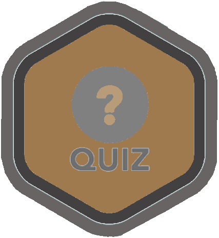

////
  Copyright 2021 The Bank of New York Mellon.

  Licensed under the Apache License, Version 2.0 (the "License");
  you may not use this file except in compliance with the License.
  You may obtain a copy of the License at

    http://www.apache.org/licenses/LICENSE-2.0

  Unless required by applicable law or agreed to in writing, software
  distributed under the License is distributed on an "AS IS" BASIS,
  WITHOUT WARRANTIES OR CONDITIONS OF ANY KIND, either express or implied.
  See the License for the specific language governing permissions and
  limitations under the License.
////
= Persistence with Spring Data JPA and Hibernate
:toc:
:toclevels: 4

Understanding how to use Hibernate and Spring Data JPA.

== Persistence with Spring Data JPA - Configuration

This example demonstrates persistence with Hibernate and Spring Data JPA

. Dependencies +
⇒ link:../../ch07_spring-data-jpa/pom.xml[pom.xml] +
There are new dependencies introduced. Look for `spring-data-jpa` in the `pom.xml`.

. *Config* - the class that specifies the component scanning instruction. +
⇒ link:../../ch06_spring-jpa/src/main/java/bnymellon/training/spring/framework/config/ColoredShapeConfig.java[ColoredShapeConfig.java] +
The config class is supplied. This config class specifies the packages to be scanned for components. +
⇒ link:../../ch06_spring-jpa/src/main/java/bnymellon/training/spring/framework/config/HibernateJPAConfig.java[HibernateJPAConfig.java] +
The class that configures the HibernateEntityManager to connect to a database.

. *Controller* layer +
⇒ link:../../ch07_spring-data-jpa/src/main/java/bnymellon/training/spring/framework/controller/ColoredShapeControllingBean.java[ColoredShapeControllingBean.java] +
The class auto-wires a `ColoredShapeService` interface, the Spring context has a
`ColoredShapeServiceImpl` that will be used as an auto-wired instance (remember the *Liskov
Substitution Principle*). The controller invokes the service methods to persist and retrieve
ColoredShape instances. The class is marked with a `@Component` annotation.

. *Service* layer +
⇒ link:../../ch07_spring-data-jpa/src/main/java/bnymellon/training/spring/framework/service/ColoredShapeServiceImpl.java[ColoredShapeServiceImpl.java] +
The class is marked with a `@Service` annotation. The `@Service` is an alias for the `@Component`
annotation (see the code). It should display a `@AliasFor(annotation = Component.class)`. The
service implementation auto-wires a `ColoredShapeDao` interface and will access the
`ColoredShapeDaoImpl` via the spring context. Methods in the service delegate to methods in the
DAO.

. *DAO* layer +
⇒ link:../../ch07_spring-data-jpa/src/main/java/bnymellon/training/spring/framework/dao/ColoredShapeDao.java[ColoredShapeDao.java] +
Notice the *_magic_* that no implementation was coded. Spring Data JPA _"figures out"_ the
implementations from the method signature. The method signatures can get complex with *AND* and
*OR* clauses. For instance, a valid method: `findOneByColorOrShape(String color, String shape)`.

A new dependency spring-data-jpa is added. A Java configuration is used to setup the embedded
database (XML could have been used as well).

The *service* layer invokes the *DAO* layer. The *DAO* layer _is simply an interface_ that
extends the `CrudRepository` from *spring-data-jpa*. `CrudRepository` provides basic method
signatures for CRUD operations on a given entity.

== Quiz time

- What is the difference between Spring JPA and Spring Data JPA?

'''

[width=100%, cols="<10%,^80%,>10%",grid=none,frame=ends]
|===
| Prev | TOC | Next

| link:06_PersistenceWithJPA.adoc[Persistence with JPA]
| link:TableOfContents.adoc[TOC]
|
|===

